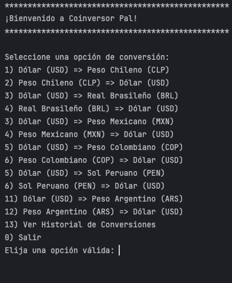
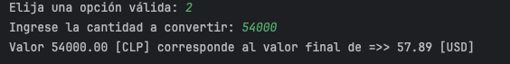
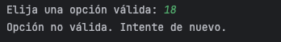
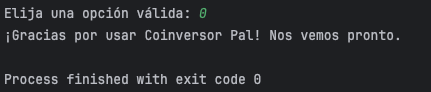

<a id="top"></a>

# 🪙 COINVERSOR PAL 🤙

<div align="right">


</div>

Una herramienta de consola robusta y eficiente para realizar conversiones de divisas en tiempo real, consumiendo directamente datos financieros actualizados.

## 📖 La Historia Detrás del Proyecto
Este proyecto nace como respuesta al primer Challenge (Oracle ONE Next Education + Alura Latam) especializado en Backend con Java. La misión inicial era clara: consumir una API, procesar datos JSON y mostrar resultados.

Sin embargo, como desarrolladora, quería ir un paso más allá de simplemente "hacer que funcione". Quería entender cómo los datos viajan a través de la red, cómo manejar respuestas asíncronas de manera elegante y cómo estructurar un proyecto Java profesionalmente.

Pasé de un simple script lineal a una arquitectura modular separando las responsabilidades (Modelo, Servicio y Vista), implementando un historial de consultas y asegurando que el usuario tenga una experiencia fluida, incluso cuando comete errores al escribir.

### 📸 __Capturas de la Aplicación__:
Así se ve la interacción en la consola, limpia y directa:<br>
> 
---
> 

---
> 

---
> 

## ✨ Funcionalidades
* __Conversión en tiempo real__: Utiliza la API [ExchangeRate-API](https://www.exchangerate-api.com/).
* __Menú interactivo__: Fácil de usar a través de la consola.
* __Soporte de monedas__: USD, CLP, BRL, MXN, COP, PEN y ARS (fácilmente expandible).
* __Historial__: Registro de las últimas conversiones con marca de tiempo.
* __Manejo de Errores__: Bloques try-catch para evitar cierres inesperados y permitir al usuario intentar de nuevo.
* __Arquitectura Limpia__: Código organizado en paquetes, separando la lógica de negocio de la interfaz de usuario.

## 🛠️ Tecnologías Utilizadas
Este proyecto fue construido utilizando estándares modernos de desarrollo Java:
* __Java JDK 25__: Utilizando Records y HttpClient.
* __Gson 2.13.2__: Para el parseo de JSON y serialización de los datos JSON provenientes de la API.)
* __Maven__: Para la gestión eficiente de dependencias y estructura del proyecto.
* __java.net.http__: Uso de la API nativa de Java para peticiones HTTP asíncronas y eficientes.
* __IntelliJ IDEA__

<div align="right"><a href="#top">⬆️ Volver Arriba</a></div>

## 📂 Estructura del Proyecto

dev.tolevats.coinversor <br>
├── 📄 Main.java       # Punto de entrada y menú interactivo <br>
├── 📄 ConsultaMoneda.java  # Servicio de conexión con la API (HttpClient) <br>
└── 📄 Moneda.java          # Record (Modelo) para mapear la respuesta JSON


## 🔮 Mejoras Futuras (Roadmap)
El backend es un mundo infinito. Algunas ideas para la versión 2.0 incluyen:
* __Persistencia de Datos__: Guardar el historial en un archivo .json o una base de datos ligera (H2/SQLite) para que no se borre al cerrar el programa.
* __Soporte Multilenguaje__: Archivos de propiedades para cambiar entre Español e Inglés.
* __Interfaz Gráfica (GUI)__: Migrar de la consola a una interfaz visual usando JavaFX o Swing.
* __Despliegue__: Crear un archivo .jar ejecutable para distribuir la aplicación.

<div align="right"><a href="#top">⬆️ Volver Arriba</a></div>

## 🛠️ _Instalación y Uso_

1. Clona este repositorio:
```
git clone https://github.com/Tolevats/coinversor.git
```

2. Configura tu API Key:
* Regístrate en ExchangeRate-API (es gratis).
* Abre el archivo ```ConsultaMoneda.java.```
* Reemplaza ```apiKey``` con tu propia API Key.

3. Ejecuta el proyecto:
* Desde IntelliJ IDEA o tu IDE favorito, corre la clase Main.
* O usa Maven desde la terminal:
```
mvn clean install
mvn exec:java -Dexec.mainClass="dev.tolevats.coinversor.Main"
```
<div align="right"><a href="#top">⬆️ Volver Arriba</a></div>

## 💬 _Contacto_
¿Te gustó el proyecto? ¿Tienes alguna sugerencia de mejora? ¡Hablemos!  👇

| [<br><sub>GitHub</sub>](https://github.com/Tolevats) | [<br><sub>LinkedIn</sub>](https://www.linkedin.com/in/pascalestavelot-dev/) | [<br><sub>BlueSky</sub>](https://bsky.app/profile/tolevats.bsky.social) |
| :---: | :---: | :---: |

<div align="right"><a href="#top">⬆️ Volver Arriba</a></div>

## 🙏 _Créditos
Desarrollado con ❤️ por Tolevats como parte del programa ONE (Oracle Next Education).

<div align="right"><a href="#top">⬆️ Volver Arriba</a></div>

---
<div align="center">
    <h3>¡Espero que disfrutes usando la aplicación tanto como yo disfruté creándola!</h3>
    <br>
    <sub>© 2025 Tolevats</sub>
</div>